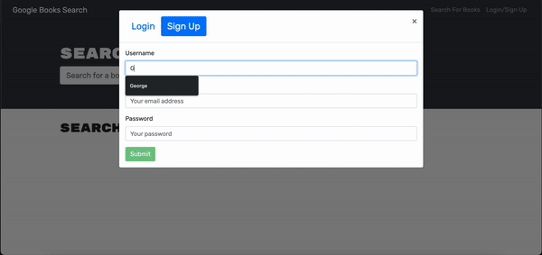
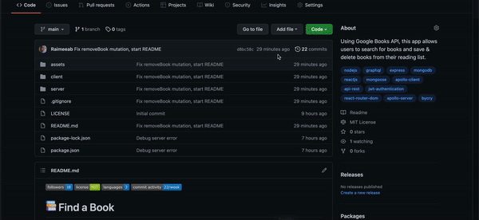
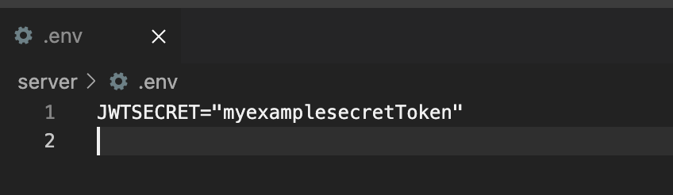
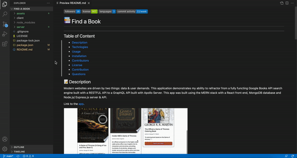
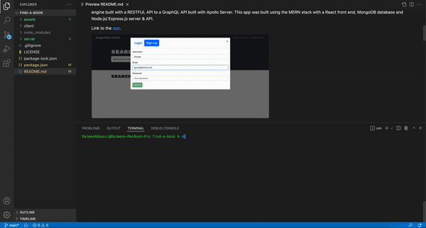

   

#   Find a Book
---

## Table of Content

- [Description](#description)
- [Technlogies](#technologies)
- [Usage](#usage)
- [Installation](#installation)
- [Contributors](#contributors)
- [License](#license)
- [Contribution](#contribution)
- [Questions](#questions)

## 📝 Description

Modern websites are driven by two things: data & user demands. This application demonstrates my ability to refractor from a fully functing Google Books API search engine built with a RESTFUL API to a GraphQL API built with Apollo Server. This app was built using the MERN stack with a React front end, MongoDB database and Node.js/ Express.js server & API. 

Link to the [app]().

## 🕹 Technologies used

- React
- React router dom
- React Bootstrap
- MongoDB
- Mongoose
- Apollo Client
- Apollo Server
- Express
- Graphql
- JWT
- dotenv
- bcyrpt

## ⚙️ Installation

1. Git clone this repository onto your local machine and navigate to the file on your terminal. _This can also be done by opening the file on Visual Studios and running it through the intergated terminal._

2. Set up an env file with with a JWT secret token in the server folder. 

3. Set up your mongoDB locally - [how to guide](https://docs.mongodb.com/guides/server/install/)

4. In the root directory, run `npm install` to download all the required dependencies.

5. To start the application, run:

   - `npm run develop`

## 🖥 Usage

User can log/ sign up to the app & add habits. When clicking the tick, they set their habit to complete for the day. If they click the remove tab they delete their habit permanently.

## 👥 Contributors

_[Raimee Abbassi](https://github.com/Raimeeab)_  
_The Univserity of Sydney | Trilogy Education Services_  

## 🔖 License

MIT License
Copyright (c) [2021] [Find-A-Book]
Permission is herby granted, free of charge, to any person obtaining a copy of this software and associated documentation files (the "Software"), to deal in the Software without restriction, including without limiation the rights to use, copy, modify, merge, publish, distribute, sublicense, and/or sell copies of the Software, and to permit persons to whom the Software is furnished to do so, subject following coditions:
The above copyright notice and this permission notice shall be included in all copies or substantial portions of the Software.

THE SOFTWARE IS PROVIDED "AS IS", WITHOUT WARRANTY OF ANY KIND, EXPRESS OR IMPLIED, INCLUDING BUT NOT LIMITED TO THE WARRANTIES OF MECHANTABILITY, FITNESS FOR A PARTICULAR PURPOSE AND NONINFRINGEMENT. IN NO EVENT SHALL THE AUTHORS OR COPYRIGHT HOLDERS BE LIABLE FOR ANY CLAIM, DAMAGES OR OTHER LIABILITY, WHETHER IN AN ACTION OF CONTRACT, TORT OR OTHERWISE, ARISING FROM, OUT OF OR IN CONNECTION WITH THE SOFTWARE OR THE USE OF OTHER DEALINGS IN THE SOFTWARE.

---

## 🤝 How to Contribute

For information on how to contribute, please follow the guidlelines listed in [Contributor Covenant](https://www.contributor-covenant.org/).

## ❓ Questions

If you have any questions, contact me via [email](raimee.abbassi@gmail.com). You can also find more of our work [here](https://github.com/Raimeeab).
